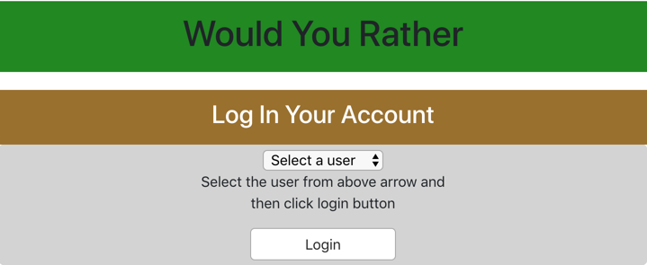
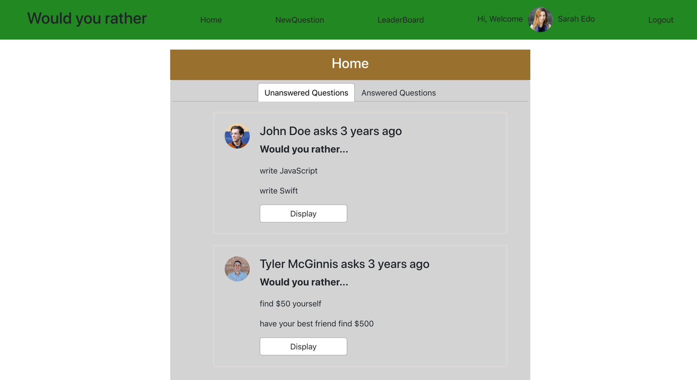
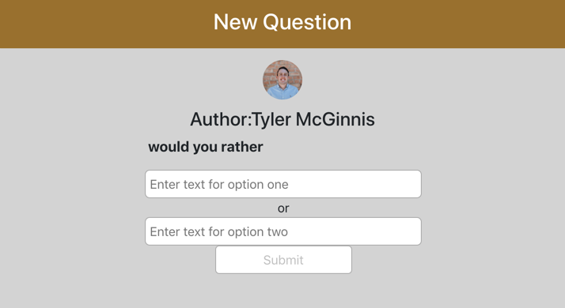
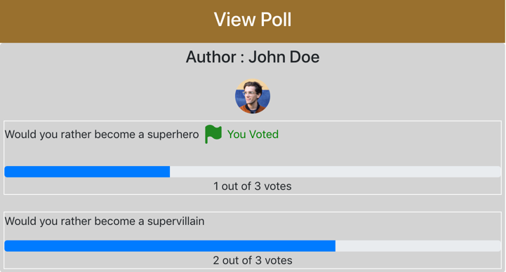
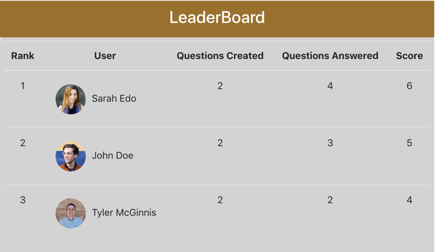

# Would you rather - Project

Would You Rather game project developed for React Nanodegree program. I used React and Redux for this application. It's second project of Udacity program.

## Installation

Upload this repository using: 
    - git clone https://github.com/SumaPrajapati/ReactND_Would-you-rather.git  
    - cd ReactND_Would-you-rather  
    - yarn install or npm install  
    - The project run on the default browser: [http://localhost:3000](http://localhost:3000)

## Login Page

In login page choose username from dropdown window and just press `Login`, so user would be login in the "would you rather" app project and it's show the Home page.

## Home Page

This home page has all Unanswered and Answered questions. It's created by all three users.

## New Question

User can create a new questions by using two options and it would be display on the home page.  
Example: Would you rather? "stay in winter" or  "stay in summer". 
 
 

## View Poll

In View Poll show the progress bar increase based on the user like the questions option. 

## Leaderboard

Leaderboard page to show rank based on the total number of questions and answers of particular user.

### Logout

If user want change user or logout from "Would you rather" application so click `Logout` and it would be appear the login page.
